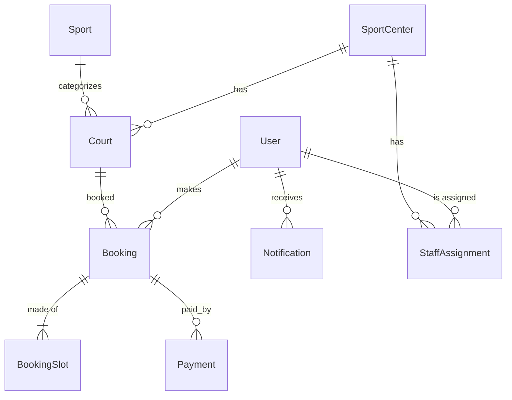

# Database Design

SQL Server via EF Core (`CourtGoDbContext`). All keys are `Guid`. Enums are stored as strings.

| Table | Key fields |
|-------|-----------|
| Users | FullName, Email (unique), PhoneNumber, PasswordHash, Role, IsActive, CreatedAt, UpdatedAt |
| Sports | Name (unique), IconUrl, IsActive |
| SportCenters | Name, Address, District, City, OpenTime, CloseTime, IsActive |
| Courts | SportCenterId, SportId, Name, Status, PricePerHour |
| Bookings | CustomerId (null = walk-in), CourtId, StartTime, EndTime, TotalAmount, DepositAmount, Status, PaymentStatus, HoldExpiresAt, CheckInCode |
| BookingSlots | BookingId, CourtId, StartTime, EndTime, Price |
| Payments | BookingId, Amount, Type (Deposit/Remaining/Refund), Method, Status, PaidAt, CollectedByUserId |
| Notifications | UserId, Title, Message, IsRead |
| StaffAssignments | UserId, SportCenterId, AssignedAt, IsActive |

## Notes
- `BookingStatus` and `PaymentStatus` are separate columns.
- A Booking = 1..n consecutive BookingSlots on the same court.
- Double-booking protection (unique/filtered index + transaction) is added with the booking engine.
- Money columns: `decimal(18,2)`.
